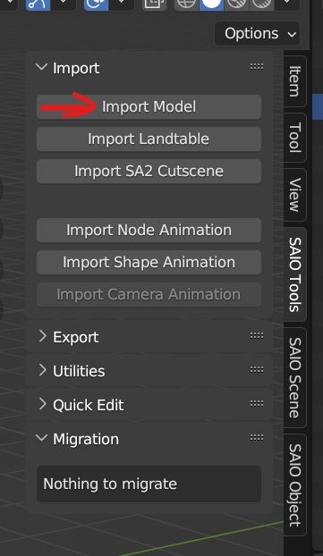
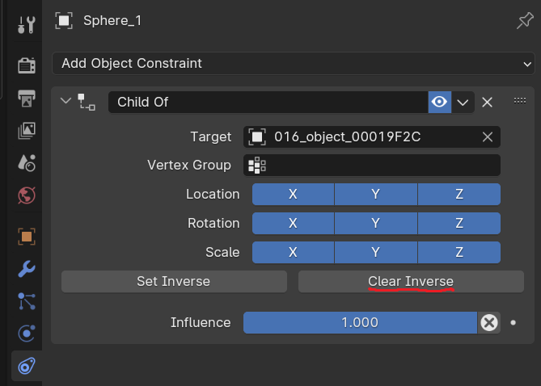
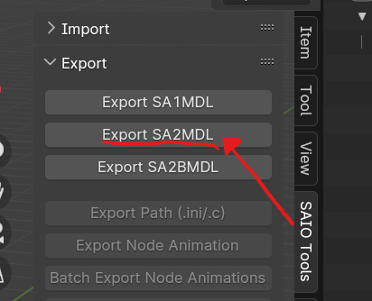
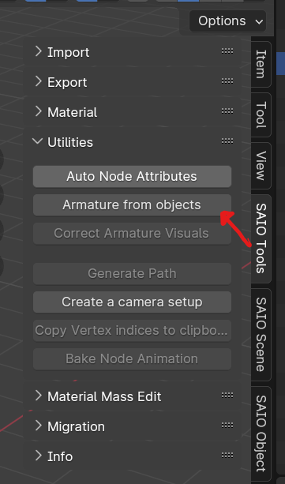
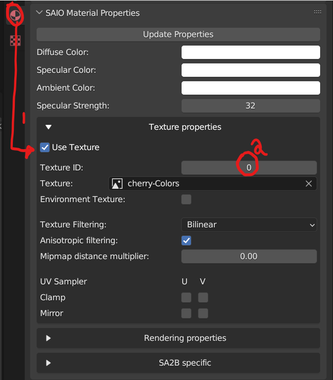
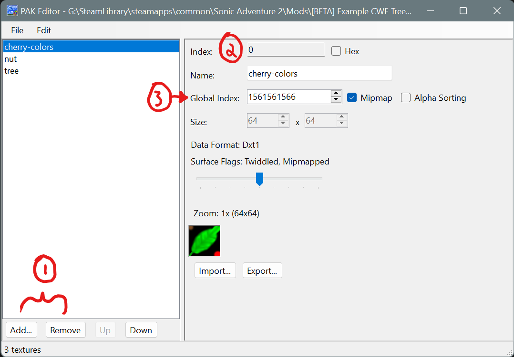
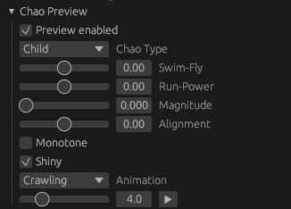
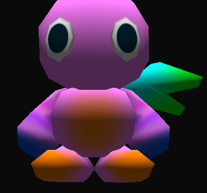
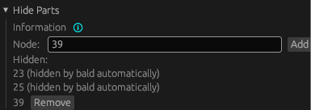
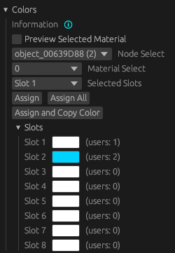

# Accessory Mods

## Pre-requisites:

* Have completed the [Making a DLL Project](MakingProject.md) section
* version 4.2 of [Blender](https://www.blender.org/)
    * [Blender SAIO plugin v2.2.0](https://github.com/X-Hax/SonicAdventureBlenderIO)
* Intermediate 3D Theory
* Basic C++ Programming skills
* SA Tools (Make sure you've created an SA Tools Project!)
* Chao World Extended (Versions >= 9.6)
* Patience

Tools can be downloaded [here](resources.md)

## What is an "Accessory"?

Accessories are a part of Chao World Extended, and have been around since version 8.3 as part of a customization model. Intially intended to expand on the ideas of hats, but without removing the Chao's head. It eventually got expanded in version 8.5 with full-body accessories. There are two methods to creating an accessory, so it'll be a longer guide than usual.

## Before we start:

* Delete all default scene objects! These objects will crash your game if you do not delete them.
* Make sure SAIO is up to date! As of writing, SAIO 2.1.5 is the most recent. Keeping SAIO and Blender up-to-date will help anyone helping you eliminate issues.
* Make sure SAIO is enabled in the Addons menu! If not, go to Edit -> Preferences and go to the Addons menu to install/enable "Import-Export: Sonic Adventure I/O"
* If SAIO errors out on any operation, and it complains about .NET runtime, install the [Microsoft .NET Runtimes](https://dotnet.microsoft.com/en-us/download) as instructed by the [SAIO Documentation](https://x-hax.github.io/SonicAdventureBlenderIO/).

## Accessory Types:

As mentioned above, there are two types of accessories: Head accessories and Full Body Accessories. Both methods require different means of modelling so they will be gone into detail separately. The difference between head accessories and full body accessories are that head accessories work much like hats, but don't remove the head, and full body accessories allow you to rig your Chao to have the accessory follow them around.

## Modelling

### Importing the model

In blender, bring up the properties panel by pressing ++n++, and navigate to the SAIO Tools tab, then click import model.



Navigate to your project folder that you created with SA Tools (Should be in Sonic Adventure 2's folder under "Projects"), navigate to `Chao/Models/AL_RootObject` and select a Chao. Make sure that it is a sa2mdl file. For this example we will be using al_ncn.sa2mdl 

How to find what type your file is: Use [the Reference page on what Chao filename you want.](RefChaoFiles.md)

### Head Accessories

Head accessories are similar to hats, so the process is pretty much the same.

For head accessories, model or import your model where you want to place the accessory to be placed, minding the position of the head. Once your model is placed on the correct place, Add an Object Constraint, with the constraint being "Child of", and use the eyedropper on the head of your Chao.  Once done, click the "Clear Inverse" button to clear the Inverse Correction of the Child Constraint, putting it in place where it's supposed to be. On export, it will auto triangulate.



Note: There is a **vertex limit of 32768** per model.

Once done, delete the hierarchy of the Imported Chao.




!!! info "A Warning about 'clearing inverse'"
    Clicking on "clear inverse" after contraining accessories might cause them to move around.

#### How to move the Accessories back to its original place after adding Constraints

First, before anything, make sure to apply all transforms.  Press ++ctrl+a++ and select "All Transforms".

Hold down ++shift+s++, and press ++1++.  Then select the model, hold down ++shift+s++, and press ++7++.  If your accessory has multiple models/meshes, do this for each model/mesh.  This works because the Chao's origin (the orange dot) should be at the world's origin (0,0,0).

This isn't needed for Body Accessories, since they do not use constraints.

### Body Accessories

For body accessories, the process is much more involved, and would need you to generate an armature in order to rig the model. 

Before you begin, take your imported Chao and note the names of the body parts you will be adding vertex groups to. For example:

```
al_ncz:
001_object_00016D7C - stomach
003_object_000167CC - left arm
010_object_00015B4C - right arm
```

Adjust for whichever Chao type you use.

Select the 000 object and go to SAIO Tools -> Utilities -> Armature from Objects. Press OK on the dialogue box to generate a new armature. Delete the imported Chao (the hierarchy starting with the 000 object) and let's begin!



Model or import your models over the parts you want to cover -- this can be any amount of body parts, be it hands, stomach, legs, or even wings! For this example, I'll be doing 4 parts - two on the stomach, one on the left arm, one on the right arm.

Select each of your models that you have imported or modelled, and go to the "Data" panel in the properties sidebar, and create a new vertex group. Name the vertex group the same as the body part you want to bind it to. Do this for every model you are adding as an accessory.


Select your items to bind to the body, select the bone that corresponds to the name of the object (make sure that the bone selected has a rounded square surrounding it) and press ++ctrl+p++ to parent the bone (Do not use bone relative). go into pose mode (++ctrl+tab++) to test if the bone controls the accessory as well as the body part.

If your bone controls the accessory as you like it, there is no need for the next step. If not, do the following:

!!! tip "How to select bones"
    Select the Armature object, go into pose mode, and then select the bone you want to use.  Once selected, go back into object mode.

Weight paint your model by selecting your model (go out of pose mode by pressing ++ctrl+tab++ again), press A (to select all the faces), and go to the "Data" panel of your model you want to weight paint. A new section should appear where we defined the vertex groups. make sure the "Weight" slider is at 1.000 and click "Assign". This should make all the faces follow the bone we created. Tab out of Edit mode and follow the next step.


Delete all the "attach_" meshes that were created with the "Armature from Objects" process, and you're done! You now have a functional body accessory!

Note: There is a **vertex limit of 32768** per model.


## Texturing in Blender

Texture your model as you would when making a model, taking into mind the size of your UVs. A smaller UV size would be preferred to make loading quicker.

Once done, open your texture menu in Blender, and open the SAIO Material Properties.



Check the "Use Texture" checkbox to use textures for your model (1), and make sure to set your texture ID (2). this corresponds to the local ID that will be loaded when you look it up in Texture Editor. Do this for any other materials you're applying to the model.

Make to save and export your file as SA2MDL so that the texture information can be held by the file. You are now done with Blender and can safely close the file. Save a backup .blend file of your model just in case of complications or difficulties for someone to help out.

## Assigning the texture in Texture Editor

Once you're done with setting the above settings on Blender, save your model and your texture and go to Texture Editor.



Add or remove the textures you want in the mod by clicking the "Add..." or "Remove" buttons at the bottom of the window (1). The index (2) corresponds to the Texture ID that you set in Blender. Create a unique Global ID (3) for each of your textures, so that your mod doesn't conflict with other mods.

Save the texture file as `.PAK`, and keep it aside for later.

## Chao World Extended Editor

As of CWE 9.6 you no longer need code to add accessories. Download the [Chao World Extended Editor](https://github.com/Exant64/cweedit/releases/latest), extract the zip anywhere and run `cweedit.exe`.

### Mod folder structure

To use the editor your mod needs a `CWE` folder, and an `Accessories` folder inside it. Your folder structure should look like this:
```
.                                                                                          
├── CWE
│   └── Accessories
│       └── ....
└── mod.ini
```

### Creating an accessory

You can create a new accessory file by clicking `File->New Accessory JSON`. Make sure to place your accessory JSON in the previously mentioned Accessories folder (the editor will not let you place it anywhere else).

You should now see the Accessory Edit view.


### Preview Settings

The Chao Preview options allow you to adjust the Chao you preview the accessory on. The most important setting in this is the Chao Type, since you want your accessory to look as good as possible on various adult Chao. The animation options also serve as a good test, especially "Crawling", since accessories can clip into the body very easily during that animation.



We advise you to leave "Render Fix Preview" on. This toggles Render Fix accurate rendering, and we believe that it's best if you futureproof how your mod looks for Render Fix use, as it will become increasingly adopted in the SA2 modding scene. More about Render Fix in a bit.

### Accessory Settings

A lot of the options here have help tooltips that you can hover over to get more info, however we'll try to go into detail on some of the more important settings.

The "Supports Render Fix" option enables Render Fix "Normal Draw" support for the accessory. As we said earlier, this is recommended! It enables proper Ambient and Specular material color support (including the exponent for specular values), texture filter options, vertex colored accessories, and proper double-sided lighting. Note that this is independent of the earlier mentioned "Render Fix Preview" option, that is only a visual setting for the editor alone. Disabling this setting will make CWE render the accessory as if Render Fix wasn't enabled.

To set the accessory's model and texture, press the "Select" button next to "Object" and "Texture". The texture needs to be in it's usual corresponding folder (**mod's folder**/gd_PC for .prs textures, **mod's folder**/gd_PC/PRS for .pak textures), and the model file (chunk model, aka .sa2mdl) needs to be in the same folder as the .json file.

The "ID" field is very important, it uniquely identifies your accessory. Make sure to come up with a unique ID, if your accessory is a hat don't just type in "hat" (for example, including the author or mod name in the ID should ensure uniqueness). Once you selected a model, a "Generate ID from Object Hash" button should show up below the ID field. This is for porting over pre-9.6 accessories to the editor, if you're doing that, make sure to let it generate an ID for you, since this way CWE *in most cases* converts the old accessory to the newly enabled editor-made one. If you're making a fresh 9.6+ accessory, **DO NOT** use this, and come up with a unique ID yourself.

#### Bald Mode

This option flattens the Chao's head to prevent clipping issues with evolution head shapes. It also hides the other Chao head parts (ex. the "bulbs" on Hero Chao) by default (you can tick "Don't hide head parts" to disable this).


The "bald" system works by morphing the Chao head vertices to the nearest point on a sphere. You can configure the radius and the center of this sphere, and also the "strength" of the morphing on each axis. Check the help tooltips for more information.


The "Presets" mode has a preset configuration that you can toggle for each axis (basically letting you shrink the chao's head on each axis).
The "Custom" mode allows you to configure the parameters of the "shrinking" more precisely. Check the help tooltips on the parameters for more info on these.

If anybody has an idea for a better name for this setting, please let us know.

#### Hide Parts

This sub-menu lets you hide specific Chao nodes (indices 0 through 39). The list also shows the ones automatically hidden by Bald settings (if enabled). You can find the index of the Chao model node you wish to hide through Blender, by checking at the number in front of the object's name. For example, for the right wing it would be 39, type 39 in the list, click Add, and the right wing should disappear.



You can click the Remove button next to the hidden node in the list to undo the change.



#### Colors

The new CWE 9.6 accessory system lets you assign "color slots" to material colors. This lets the player change colors on the accessories, leading to more customization in general. A color slot can be assigned to multiple materials at the same time. They also have a default color specified, for example a hat can always start out as a blue hat in the market, but the player can change it to whatever once they bought it.



The "Node Select" and "Material Select" options let you select which object and which material in said object you wanna assign a color slot to. You can select the color slot you want to assign to the material using the "Selected Slots" dropdown. The "Assign" button, as it suggests, just assigns the selected material to the selected color slot. "Assign All" assigns all the materials for the selected object to the slot. "Assign and Copy Color" assigns and simultaneously copies the material color to the slot.


Once you assigned a slot to the selected material, it shows the currently used slot below the dropdowns. You can change the color of the slots in the slots list by clicking on it. The "users" text next to the slot shows how many materials use the slot currently.

### Saving

If you followed all instructions till now, all you have to do is click the "Save" button on the bottom of the editor panel, and enable your mod!

### Final notes

You can freely open CWE's own accessories to take a look at how they're set up if it's any help. This also applies to any other accessory mods that will come out that were made through the editor.

Since the documentation for the editor was a tad bit rushed, if anyone feels like there isn't enough detail, feel free to ping Exant or message them about any suggestions, since they wrote the editor part of the guide.

## Troubleshooting:

If you have any issues with any of the mod creation process, check the [Troubleshooting page](troubleshooting.md) to see if your problem is mentioned. If you have other issues with the mod creation process, ask around in the Chao Island Discord. If the issue is of importance to note, it will be added to the documentation after being mentioned.


