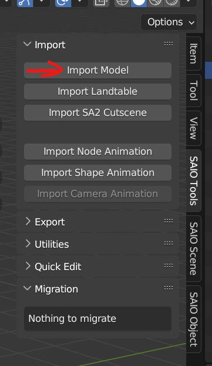

# Custom Chao Animation

## Pre-requisites:

* Have completed the [Making a DLL Project](MakingProject.md) section
* version 4.2 of [Blender](https://www.blender.org/)
    * [Blender SAIO plugin v2.2.0](https://github.com/X-Hax/SonicAdventureBlenderIO)
* Animation theory
* Basic C++ Programming skills
* SA Tools (Make sure you've created an SA Tools Project!)
* Chao World Extended (Versions >= 9.6)
* Patience

## What is a "Chao Animation"?

!!! note "A note:"
    Currently, we only document **replacing vanilla animations**, as new animations don't have any use without new behaviors, and that's out of scope for the API (at the time of writing).

Custom Animations are a part of Chao World Extended API, where you can make your Chao move in a unique way. Chao can be animated for a certain amount of frames, transitioned in and out of different animations, with different start and end frames, at different speeds. Chao World Extended introduced custom animations API support from version 9.5, but code has existed for it when the Omochao building features were added.

## Before we start:

* Make sure SAIO is up to date! As of writing, SAIO 2.1.5 is the most recent. Keeping SAIO and Blender up-to-date will help anyone helping you eliminate issues.
* Make sure SAIO is enabled in the Addons menu! If not, go to Edit -> Preferences and go to the Addons menu to install/enable "Import-Export: Sonic Adventure I/O"
* If SAIO errors out on any operation, and it complains about .NET runtime, install the [Microsoft .NET Runtimes](https://dotnet.microsoft.com/en-us/download) as instructed by the [SAIO Documentation](https://x-hax.github.io/SonicAdventureBlenderIO/).

!!! warning "A warning:"
    Animations MUST have one root bone, otherwise exports will error out!

## Importing the model:

In blender, bring up the properties panel by pressing ++n++, and navigate to the SAIO Tools tab, then click import model.



Navigate to your project folder that you created with SA Tools (Should be in Sonic Adventure 2's folder under "Projects"), navigate to `Chao/Models/AL_RootObject` and select a Chao. Make sure that it is a sa2mdl file. For this example we will be using al_ncn.sa2mdl 

!!! note "note"
    The game expects the animation file to be done on a Child model. While it *is* possible to do the animation on an Adult Chao, proportions will be strange for Child Chao. See the [example animation](examples.md) for an example of what the issue looks like, as that was done using al_nnn.sa2mdl

How to find what type your file is: Use [the Reference page on what Chao filename you want.](RefChaoFiles.md)

Select the 000 object and go to SAIO Tools -> Utilities -> Armature from Objects. Press OK on the dialogue box to generate a new armature. Delete the imported Chao (the hierarchy starting with the 000 object) and let's begin!


## Animating:

!!! tip "Things to consider"
    Consider the start frame, end frame and the speed of how your animation will look.  On Export, your animation will be set to "linear" interpolation and then keyframed on each tween.

!!! danger "be careful!"
    CWE Animations only support position and rotation for Chao! If you accidentally keyframe a scale component, follow [this troubleshooting step](troubleshooting.md#animation) on how to remove an animation keyframe separately.

If you'd like, change the animation editor type to the "Dope Sheet" editor, and then select the editor context as "Action Editor". This will allow you to see multiple (or all) keyframes at once and edit your keyframes if you're having trouble with viewing only one set of keyframes.

 

Select your Armature, so into Pose mode using ++ctrl+tab++ and select a body part.  Keyframe the starting frame for your animation, and press ++k++ to open the Keyframe menu. Select "Position", "Rotation" or "Position and Rotation" depending on what you've done.

Move the current frame playhead to the next frame you want to animate (you can skip frames if you'd like, exporting will interpolate the frames linearly) and make changes to the same body part. Keyframe the frame again and repeat as necessary.

Do this as many times as you'd like, for as many body parts as you like.  If you want to preview the animation, select all the keyframes, press ++t++ (interpolation mode) and select "Linear", then adjust the keyframes as you would like. To preview the animation, press the ++spc++ key (by default, this can be changed in settings) in the main 3D Viewport.

!!! note "tip:"
    Blender's animation framerate is 24 FPS with a base of 1.000. This is **not** the same framerate that Sonic Adventure 2 plays Chao animations at.  Sonic Adventure 2 runs at 60 frames per second, so to preview the framerate, set your framerate as custom, you'd use 60 as the FPS, and `1/speed` as your base (in our example we are using 0.12f so we'd use `1/0.120` as our base.)

    Try and experiment with the base and find what works best for you! Once done, note your base down as this will be the speed of the animation.
## Exporting the animation:

Before you go any further, take a note of the following:

* The start frame of your animation
* The end frame of your animation

These are needed for the code we will write later down the line.

Select the root node of the animation, and then go to SAIO Tools -> Export -> Export Node Animation. It will bring up a save dialog allowing you to save your animation as an SAANIM file. in the "Operator presets" panel, expand Rotation, and click the "Use 16 bit rotations" checkbox. Save your animation file.


## Finding the animation to replace:

We need to find an animation to replace before going ahead to code. 

Open a new instance of Blender, and import a Chao of your choice. Make an "Armature from Objects" armature and select it, and then go to SAIO Tools -> Import -> Import Node Animation. Go to [your SA Tools Project Folder]/Chao/Models/al_motion_table. Select any of the .saanim files there.

Change your Animation timeline Editor type to Dope Sheet, Action Editor and note down the action name. For example, 

alm_book.saanim - animation_002FBAB0

Now that we have the action name, go to the al_motion_table folder in File Explorer. find the "info.ini" file and open it. search for the action name you noted down. The number in the square brackets above the Motion name will be the animation ID.  Here is how I'd note it:

alm_book.saanim - animation_002FBAB0 - AnimID = [337]

## Code:

If you have not created a Visual Studio project yet, follow the instructions on "[Setting up your development environment](DevSetup.md)".

### Animation specific dependency

Clone or download the `AnimationFile.cpp` and `AnimationFile.h` from [LibModUtils](https://github.com/X-Hax/sa2-mod-loader/tree/master/libmodutils)

You will need to change the first include in `AnimationFile.cpp` in order to fix a problem -- change `#include "stdafx.h"` to `#include "pch.h"`.

If you don't replace the include, this error will occur!


Afterwards, Add the files into your project by right clicking "Header Files" in your project explorer and going to Add -> Existing Item... to add `AnimationFile.h` and `AnimationFile.cpp`


If you aren't adding models, you can safely remove `ModelInfo.h` and `ModelInfo.cpp` as you don't access functions from there.

### Setting up the Animation File Library:

Where your `#include` declarations are, add the AnimationFile header library.

```cpp
#include "AnimationFile.h"
```

Inside the `extern "C"` function, add the following line:

```cpp
AnimationFile* exampleAnimation;
```

This gives us space to add our SAANIM file into the game. It's currently empty, so let's define our animation.

Inside the `Init` function, below the `pathStr` variable, add the following for each animation file you're adding:

```cpp
exampleAnimation = new AnimationFile(pathStr + "exampleAnimation.saanim");
```

Replace `exampleAnimation` with whatever your `AnimationFile` pointer variable was called, and change the filename to the appropriate saanim animation file.

### Adding the animation:

In the CWEAPI_EarlyLoad function, we will need to set up a `MOTION_TABLE` - This is what defines our animation, and ultimately gives us everything we need to call the animation.  The syntax is as follows:

```cpp
MOTION_TABLE <anim_name> = { &custom_motion, loop, posture, TransitionID (-1 or Vanilla ID), Transitionspeed(-40), StartFrame, EndFrame, Speed};
```

Let's break it down:

`MOTION_TABLE <anim_name>` - We're defining a variable in the CWE API of type `MOTION_TABLE`.

`&custom_motion` - This is the NJS_MOTION in the AnimationFile variable we created earlier. Remember to use an '&' so we can reference the pointer.

`loop` - This defines the loop function.  The following loop functions are available (undocumented, but brief):

* 0 - Don't loop
* 1 - loop normal
* 2 - loop ping-pong

`posture` - This is the initial animation posture.  The following posture functions are available:

* 0 - Standing
* 1 - Sitting
* 2 - Lying down
* 3 - Fused posture
* 4 - Others (???)

!!! note
    the enum for loops and postures are not inside CWE API, so not everything is known about this. Feel free to experiment with the values given.

`TransitionID` - This is the next animation to transition to -- Use -1 to skip this step, or use any vanilla ID to transition to that animation. For the example file we use -1 as we don't want to transition to another animation. You can chain animations as well using another function.

`TransitionSpeed` - Defaults to -40, but is the speed from current animation to the TransitionID.

`StartFrame` - The Start Frame of the animation. Usually 0, as that's the default frame in Blender's timeline.

`EndFrame` - The End Frame of the animation. This will be the final frame in your timeline.

`Speed` - The playback speed of the animation. We use 0.12f as an example, but the formula for speed is `fps * speed`. Implying 60FPS, our speed formula would look as follows: `60 * 0.12f`.

Put together, here is an example of what it'll look like:

```cpp
MOTION_TABLE motionTableEntry = { testAnimation->getmotion(), 0, 0, -1, -40, 0, 5, 0.12f};
```

Now that we've got the MOTION_TABLE, let's replace animation 337.

``` cpp
*pAPI->pRegister->pMotion->GetChaoMotionTable(337) = motionTableEntry;
```

The value on the left is the vanilla Animation (in our example alm_book.saanim) and the value on the right is our animation we're changing.

### Building the Project:

Your solution configuration should be "Release" and your solution platform should be "x86" so that your mod is small, and does not have the additional code inside your mod. Your configurations should look like the following image below:


Build the project by pressing ++f6++ or going to Build -> Build Solution. If you have a "Build Succeeded" in your tooltip at the bottom left of your Visual Studio window, proceed. If you have a "Build Failed" message, have a look at the [Sample mod](examples.md) to see where you went wrong, and try again. 

If you still can't get your build to work, try using the example mod as a template.

## Creating the mod:

If you haven't followed [Making a Project](MakingProject.md), set up your mod folder. Copy the DLL file from inside your release folder into your mod folder and edit your "mod.ini" file to contain your DLLFile. For example:

```ini
DLLFile=ExampleMod.dll
```

Place your .saanim animations inside the mod folder.

Save your "mod.ini" file and test your mod!

## Troubleshooting:

If you have any issues with any of the mod creation process, check the [Troubleshooting page](troubleshooting.md) to see if your problem is mentioned. If you have other issues with the mod creation process, ask around in the Chao Island Discord. If the issue is of importance to note, it will be added to the documentation after being mentioned.
