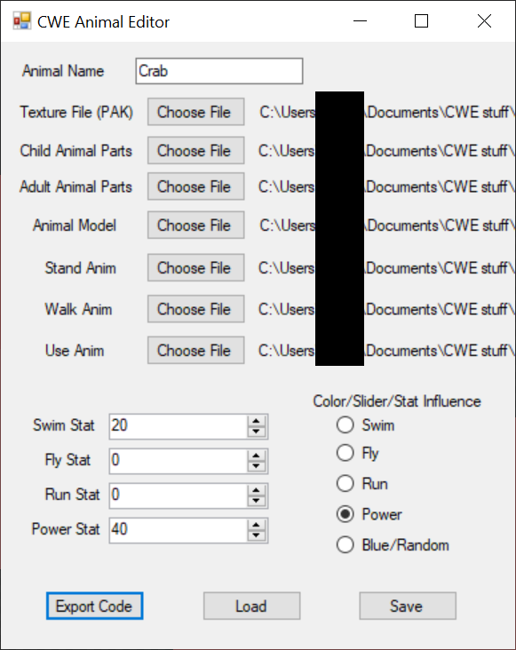
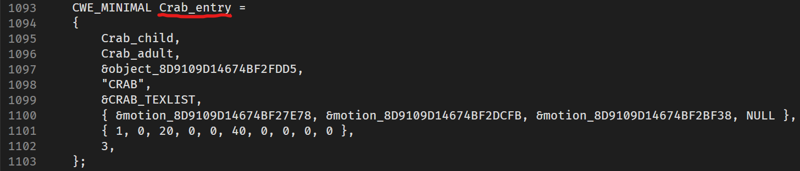

# Custom Animal Mods

## Pre-requisites:

* Have completed the [Making a DLL Project](MakingProject.md) section
* version 4.2 of [Blender](https://www.blender.org/)
    * [Blender SAIO plugin v2.2.0](https://github.com/X-Hax/SonicAdventureBlenderIO)
* Intermediate 3D Theory
* Basic C++ Programming skills
* SA Tools (Make sure you've created an SA Tools Project!)
* Chao World Extended (Versions > 9.5)
* An existing fruit mod.
* Patience

Tools can be downloaded [here]

## What is an "Animal"?

Custom Animals are an extension of the Chao Animal system, where you can give a Chao the animal for it to absorb the animal and gain some of its parts randomly. Chao World Extended introduced custom animals from version 8.0, and allowed for customization from version 8.5. Animals spawn from fruit when looking away from the fruit. 

Custom Animals require a [Fruit Mod](FruitModding.md) so be sure to have created one before proceeding!

## Before we start:

* Delete all default scene objects! These objects will crash your game if you do not delete them.
* Make sure SAIO is up to date! As of writing, SAIO 2.1.5 is the most recent. Keeping SAIO and Blender up-to-date will help anyone helping you eliminate issues.
* Make sure SAIO is enabled in the Addons menu! If not, go to Edit -> Preferences and go to the Addons menu to install/enable "Import-Export: Sonic Adventure I/O"
* If SAIO errors out on any operation, and it complains about .NET runtime, install the [Microsoft .NET Runtimes](https://dotnet.microsoft.com/en-us/download) as instructed by the [SAIO Documentation](https://x-hax.github.io/SonicAdventureBlenderIO/).

## Preparations
You will need the following before progressing further:

* An existing Fruit mod
* The Animal Editor Tool by Exant [here](https://github.com/Exant64/AnimalEditor)

## Modelling

### Animal

Import an animal from the `Chao/Animals` folder in your SA Tools Project. Any model will do, as long as the prefix is "MINIMAL" and ends in ".SA2MDL". This will give you the required scale for reference of your model.

Create the animal you want to add into the game, using the scale of the imported model as a reference of how large the animal has to be. Make sure to UV and texture the model as necessary.

Create an [Empty](https://docs.blender.org/manual/en/latest/modeling/empties.html) (Plain Axes is recommended) object at world origin (0, 0, 0) and parent all your animal meshes to the Empty object that was created.  Make sure that your animal's feet are on the "floor" (0 on the Z axis) of world space, so that the animal appears in the right location.

Apply Scale and Rotation of your model, and make sure your model is complete at this point. Save your model in case anything goes wrong.

Select the Empty object, and go to SAIO Tools -> Armature from Objects. Press OK on the dialogue box to generate a new armature. Delete the original Empty hierarchy as we no longer need it. (You can create an incremental save in File -> Save Incremental as this is the start of your modding process)


Your armature now needs to be tweaked so that the head of each of the bones are in the corect position. Select the head of each of the bones and move them as appropriate in Edit Mode. This step is optional, but will help for animating your rig when you get to that step.

Save and export your animal as the SA2MDL format. This model will be used for the Animal Editor tool.

### Animation

There are 3 sets of animation for animals. The table below describes how many frames of animation are needed, as well as what animation types need to be keyed and created as "animation nodes":

|Animation Type|Frames required|
|--------------|---------------|
|Stand|4 Frames|
|Walk|15 Frames|
|Hold/Use|14 Frames|

Set your initial keyframe at 0, and the ending keyframe at the required number of frames. Animate as necessary, making sure the interpolation mode of your animation is set to linear (select your frames, press ++t++, select "linear").

Go to SAIO Tools -> Export -> Export Node Animation to each animation separately. This will save it as an .SAANIM file needed for the Animal Editor tool.

### Chao

Import a Chao model of your choice, starting with a Child Chao. Prepare the animal parts you wish to add to the Chao, hiding the original Chao body parts as you go along. You will need to name the body parts a specific way, so that the Animal Edior can recognize them on import. ***These names are case sensitive!*** Constrain each part to their respective "Empty" parent object.

|Body Part|Object Name|Constraint Index|
|---------|-----------|----------------|
|Left Arm|arm_l|003|
|Right Arm|arm_r|010|
|Left Ear|ear_l|024|
|Right Ear|ear_r|026|
|Left Leg|leg_l|006|
|Right Leg|leg_r|013|
|Face|tongue|028|
|Tail|tail|008|
|Left Wing|wing_l|037|
|Right Wing|wing_r|039|
|Left Horn|horn_l|030|
|Right Horn|horn_r|031|

Delete the Chao hierarchy and save as an SA2MDL. This will be used in the Animal Editor as a Child Chao.

**OPTIONAL**: Repeat the above steps for an Adult model if you want different models or textures for the adult. Save it as a second SA2MDL, which will be used for the Adult Chao.

### Using the Animal Editor Tool

Extract the Animal Editor tool to an easily accessible location, and open it. Load the files according to each of the items that was created in the modelling process. Your completed file should look as follows:



Click "Export Code" and save the .mini file to create a large text file containing your model and animation data. This will be used in the coding section.

## Code

We will be using our fruit mod from a previous section. 

In order to proceed, we will need a fruit mod. Take your existing fruit mod that you made from the [Fruit Modding Documentation](FruitModding.md) to get started. If you do not have a fruit mod. Make one by clicking the link to get started!

In the `main.cpp` file, inside the `extern "C"` function, include your `.mini` file that you created during your modelling process. The `.mini` file contains all your geometry and bindings for textures, so we will not need any more SA2MDL files at this point. For example:

```cpp
#include "ExampleAnimal.mini"
```

Inside `CWELoad`, we will create an ID for the animal, using the .mini file's struct. At the bottom of the `.mini` file, you will find the following. Copy the variable name from your `CWE_MINIMAL` struct.



Next: create the variable, using the copied varaible name inside the `AddChaoMinimal` function. Make sure to reference the varaible as it's reading from the struct in the `.mini` file.

```cpp
int mini_ExampleAnimalID = cwe_api->AddChaoMinimal(&ExampleAnimal_entry);
```

Now we need to bind it to the fruit:

```cpp
cwe_api->RegisterChaoMinimalFruit(ExampleFruitID, mini_ExampleAnimalID, 0, 50);
```

### Building the Project:

Since your fruit mod was already set up, all you need to do is click on Build -> Build Solution, or press F6.

## Creating the mod:

If you haven't followed [Making a Project](MakingProject.md), set up your mod folder. Copy the DLL file from inside your release folder into your mod folder and edit your "mod.ini" file to contain your DLLFile. For example:

```ini
DLLFile=ExampleMod.dll
```

Place *ONLY* the SA2MDL Fruit models in your mod folder. Your animals are built into the mod DLL file, and there is no need to add the SA2MDL or SAANIM files.

Update your textures to contain the animal textures your mod needs.

Save your "mod.ini" file and test your mod!

## Troubleshooting:

If you have any issues with any of the mod creation process, check the [Troubleshooting page](troubleshooting.md) to see if your problem is mentioned. If you have other issues with the mod creation process, ask around in the Chao Island Discord. If the issue is of importance to note, it will be added to the documentation after being mentioned.