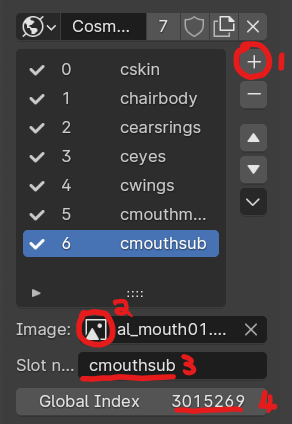

# Character Chao Modding

## Pre-requisites:

* Have completed the [Making a DLL Project](MakingProject.md) section
* version 4.2 of [Blender](https://www.blender.org/)
    * [Blender SAIO plugin v2.2.0](https://github.com/X-Hax/SonicAdventureBlenderIO)
* Intermediate 3D Theory
* Basic C++ Programming skills
* SA Tools (Make sure you've created an SA Tools Project!)
* Chao World Extended (Versions > 9.5)
* Patience

## What is a "Character Chao"?

Character Chao are special Chao that were used for events in Sonic Adventure 2: Battle for the Gamecube. The Amy, Tails and Knuckles Chao were distributed via a special disc that allowed for players to legitimately obtain them. With the advent of Chao Editors, it was possible to obtain these through the "Chao Type" option. Starting from Chao World Extended 9.5, and the CWE API, we are now able to create custom Character Chao.

## Modelling

### Before we start:

* Delete all default scene objects! These objects will crash your game if you do not delete them.
* Make sure SAIO is up to date! As of writing, SAIO 2.1.5 is the most recent. Keeping SAIO and Blender up-to-date will help anyone helping you eliminate issues.
* Make sure SAIO is enabled in the Addons menu! If not, go to Edit -> Preferences and go to the Addons menu to install/enable "Import-Export: Sonic Adventure I/O"
* If SAIO errors out on any operation, and it complains about .NET runtime, install the [Microsoft .NET Runtimes](https://dotnet.microsoft.com/en-us/download) as instructed by the [SAIO Documentation](https://x-hax.github.io/SonicAdventureBlenderIO/).

!!! danger "Things to bear in mind!"
    * Character Chao are **40 nodes** large, which means that there should be a combination of 40 objects, both empties and meshes. If you go any higher or lower, the game will output an error in the console!
    
    * If you have any Vertex Color attributes, an error will appear in the console! remove any of them in the Data -> Color Attributes menu by selecting them and pressing the - button on the right of the menu.

### Preparation:

Start off by finding the closest reference to the Chao you want to create.  It can be any Chao model, as that will be your starting point for the Custom Character Chao. If you want smaller proportions, use a Child Chao. If you want bigger proportions, use an Adult Chao.

Alter any of the existing geometry as you see fit in Edit Mode, minding for the current UVs.

### (Optional) Adding new Geometry
Add any new geometry on the Chao by making the necessary meshes as they should appear, bearing in mind the style of the Chao.

!!! warning
    Do not UV map the extra geometry until you've joined the parts together. When joining, your UVs will disappear, meaning you will need to remap your UVs after you have joined them.

Now that you have added geometry, select the items you want to join together, *then* select the item you want to join them with, and press ++ctrl+j++. This will join all the geometry into the destination object, and maintain the necessary flags in the object.

To select the geometry that you have added in Edit Mode, deselect everything, hover your pointer over the geometry you want to edit, and press ++l++. This will select the object so that you can UV Unwrap it. Mark seams as necessary before UV unwrapping.  If you're having trouble viewing the object, press ++slash++ to go into local mode and focus on the object you have selected.

!!! warning "Moving geometry"
    If you move any of the geometry of the Chao, animations will break!

### Texturing

!!! danger "Heads up!"
    ALL your textures have to be assigned and within the amount specified in the `TextureCount` variable! Make sure you make the TextureCount variable *exactly* the amount of textures you need! Anything out of bounds will output an error in the console!

Texture your Custom Chao as you would any other model, taking into mind the amount of textures you use. If you want to create custom UVs for the Chao, this would be a prime opportunity to do so. Make sure the "Use Texture" checkbox is ticked for every texture you're adding, and make sure to apply a texture to all the texture slots of an associated model.

!!! note "Regarding the mouth:"
    The mouth needs 2 material slots and 2 Texture IDs, much like the vanilla mouths.

!!! tip "How Chao colors work:"
    The texture that is used for the Character Chao skin is *multiplied* to the base color of the Chao. This means that the background of the texture should be "white" (Hue: 0, Saturation: 0, Value: 1).

### Using SAIO to create the texture file:

Set up your texturing environment by going to SAIO Scene -> Textures and selecting the "World" texture list by clicking the globe icon on the left. Add every texture into the texture file by clicking the + button (1), assigning an image to the texture (2), Adding a name to the texture (3) and assigning a unique Global Index to your texture.



Note the number of textures you have added (in this case it was 7 - a trick is to look at the local Texture ID of the last item you've added, and add 1) - Note it down as this is your `TextureCount` when you set up the code to register the Chao.

click the down arrow and click "Export as Texture Archive" and save it as a .PAK file.

!!! warning "Regarding texture files:"
    Because we're injecting into an already existing texture pack (al_body.prs), a separate texture file **must** be created for this project!

### Testing if all models are assigned:

Go to SAIO Tools -> Material and click the "Update Material Textures" button. If any of the material textures are black, you will need to assign textures to those models. Check the Texture ID to make sure it is within the range of your `TextureCount` as well.

Export your SA2MDL model if everything goes well. Save a .blend file just in case something goes wrong!

## Code

If you have not created a Visual Studio project yet, follow the instructions on "[Setting up your development environment](DevSetup.md)".

### Adding Custom Models:

Create a `ModelInfo` pointer variable for each of the models you are about to add inside the `extern "C"` function. For example:

```cpp
ModelInfo* MDLExampleCharacterChao;
```

This is empty at the moment, so let's define it. In the `Init` function. underneath the `pathStr` variable, add the following for each model:

```cpp
MDLExampleCharacterChao = new ModelInfo(pathStr + "ExampleCharacterChao.sa2mdl");
```

Replace `MDLExampleCharacterChao` with whatever your `ModelInfo` pointer variable was called, and change the filename to the appropriate model.

### Creating the Evolution Function:

Create a static [function pointer](https://en.cppreference.com/w/cpp/language/pointer#Pointers_to_functions) to evolve the Chao. The function pointer allows us to pick a requirement from `ObjectMaster` for our Chao to evolve. Place the function in `extern "C"`:

```cpp
	static bool ExampleChaoEvolve(ObjectMaster* tp)
	{
		if (/* Your requirement here */)
			return true;
		else
			return false;
	}
```

Explore the `tp->Data1.Chao->ChaoDataBase_ptr->` structrure by pressing ++ctrl+space++ and scrolling down the Intellisense list to see what values you can use. If you want some examples of values you can use, go [here!](ChaoDataStruct.md) Take into mind what the struct varaible you use has as a data type.

!!! info "Using names"
    To use a name to evolve the Chao, you will need to use a [strcmp](https://en.cppreference.com/w/c/string/byte/strcmp) call to compare the name to the string you need. You also have to take into mind the [Chao Name Encoding](https://chao-island.com/guides/chao-hacking/hacking-pc/chao-name-encoding) when writing your name. For example, when the Cosmo Chao mod was made, "\x23\x4F\x53\x4D\x4F" was used as a condition to check for the name "Cosmo" - Take this into mind!

!!! hint "Using custom accessories"
    Go [here](CharChaoCustomAccessories.md) to find out how to use custom accessories for the Evolution Function.

### Adding the Custom Chao

Now we set up the Chao! In the `CWELoad` function, create a `CWE_API_CHAO_DATA` struct variable. For example:

```cpp

    CWE_API_CHAO_DATA CharChao_pData =
    {
        MDLExampleChao->getmodel(),	//pObject
        {0},						//pSecondEvoList[5]

        "ExampleChao",				//TextureName
        7,							//TextureCount
        0xFFFFFFFF,					//IconColor - hex, 4 bytes, 0xAARRGGBB
        ICON_TYPE_HALO,				//IconType
        NULL,						//pIconData

        ExampleChaoEvolve,			//pEvolveFunc

        0,							//Flags
        "Example Chao",				//Name
        "ExampleChao",		    	//id
    };

```

Let's break this down, since it's such a big structure:

`CWE_API_CHAO_DATA` - This is a struct which defines the necessary data needed for your Chao, inside the CWE API. It contains the following, in the following order:

* pObject - Your Chao Model

* pSecondEvoList[5] - This is a custom Chao Evolution list, which is unsupported at the moment. Just use `{0}` for now.

* TextureName - This is your texture file to inject. Texlists are unsupported because of texture injection!

* TextureCount - This is the count of textures in your texture file. You should have noted this down in the modelling section of this guide.

* IconColor - This is a hexadecimal AARRGGBB number that gives you color to your `IconType`

* IconType - There are 4 types you can use (3 supported at the moment) - `ICON_TYPE_BALL`, `ICON_TYPE_HALO`, `ICON_TYPE_SPIKY` and `ICON_TYPE_CUSTOM` (unsupported for now, don't use.) for your emoticon ball for your Chao.

* pIconData - A placeholder for custom emotion balls. Unsupported for now.

* pEvolveFunc - This is the Evolution Function that you created in the previous section to obtain your Chao.

* Flags - Keep at 0 for now. This is for the Custom Chao second evolution, which is unsupported at the moment.

* Name - This tells you the type of the Chao at the Health Center, and reflects on Krzys2 Chao Editor.

* ID - a text ID. This has to be null terminated and is used to place the Chao into CWE.

At the end of all of this, add your Chao Type just below your Character Chao struct:

```cpp
    cwe_api->AddChaoType(&CharChao_pData);
```

### Building the Project:

Your solution configuration should be "Release" and your solution platform should be "x86" so that your mod is small, and does not have the additional code inside your mod. Your configurations should look like the following image below:


Build the project by pressing ++f6++ or going to Build -> Build Solution. If you have a "Build Succeeded" in your tooltip at the bottom left of your Visual Studio window, proceed. If you have a "Build Failed" message, have a look at the [Sample mod](examples.md) to see where you went wrong, and try again. 

If you still can't get your build to work, try using the example mod as a template.

## Creating the mod:

If you haven't followed [Making a Project](MakingProject.md), set up your mod folder. Copy the DLL file from inside your release folder into your mod folder and edit your "mod.ini" file to contain your DLLFile. For example:

```ini
DLLFile=ExampleMod.dll
```

Place your .SA2MDL models inside the mod folder.

Add a folder in your mod directory called "gd_PC", and inside that folder, add another directory called "PRS". Inside the "PRS" folder, add your `.PAK` texture files.

Save your "mod.ini" file and test your mod!

## Troubleshooting:

If you have any issues with any of the mod creation process, check the [Troubleshooting page](troubleshooting.md) to see if your problem is mentioned. If you have other issues with the mod creation process, ask around in the Chao Island Discord. If the issue is of importance to note, it will be added to the documentation after being mentioned.