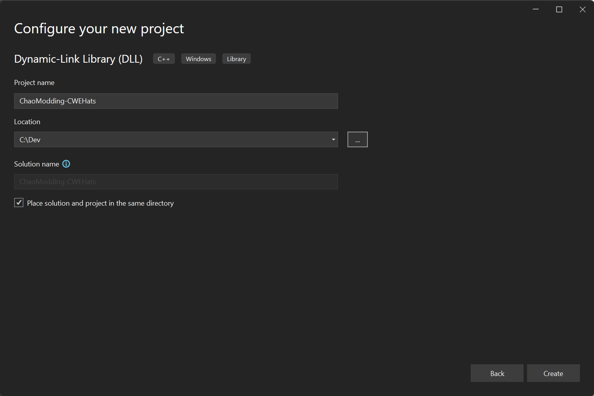

# Setting up your development environment

1. Open Visual Studio (in the case of this guide, it will use 2022 Community edition)
2. Create a new project -> C++ -> Dynamic Link Library (DLL)
3. Name your project a suitable name, and place it somewhere easy to locate.  You will need to go to the folder to grab your DLL file once you've built it to create the mod.

