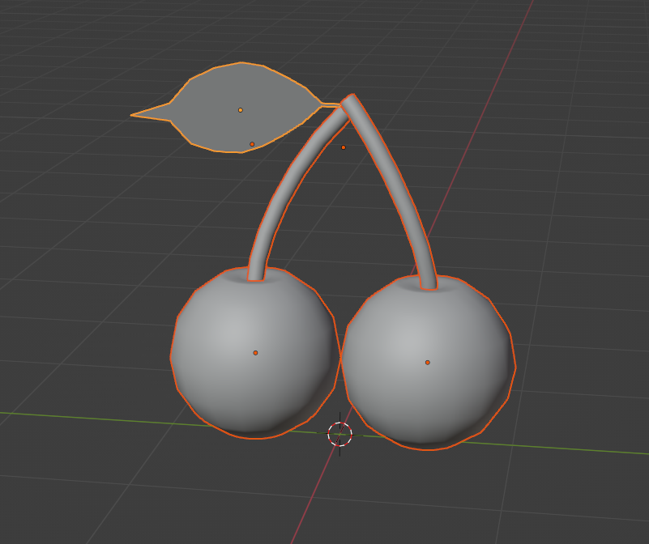

# Fruit Mods

## Pre-requisites:

* Have completed the [Making a DLL Project](MakingProject.md) section
* version 4.2 of [Blender](https://www.blender.org/)
    * [Blender SAIO plugin v2.2.0](https://github.com/X-Hax/SonicAdventureBlenderIO)
* Basic 3D Theory
* Basic C++ Programming skills
* SA Tools (Make sure you've created an SA Tools Project!)
* Chao World Extended (Versions > 9.5)
* Patience

Tools can be downloaded [here](resources.md)

## What is a "Fruit"?

Fruits are customizable food for your Chao, which allow you to generate stats, modify attributes of your Chao, and do many other sub-mods ([Trees](TreeModding.md) and [Animals](AnimalModding.md)) in Chao World Extended.

There are a limit of 255 fruit slots in total, some of which are already taken by Sonic Adventure 2 by default.

## Modelling

## Before we start:

* Delete all default scene objects! These objects will crash your game if you do not delete them.
* Make sure SAIO is up to date! As of writing, SAIO 2.1.5 is the most recent. Keeping SAIO and Blender up-to-date will help anyone helping you eliminate issues.
* Make sure SAIO is enabled in the Addons menu! If not, go to Edit -> Preferences and go to the Addons menu to install/enable "Import-Export: Sonic Adventure I/O"
* If SAIO errors out on any operation, and it complains about .NET runtime, install the [Microsoft .NET Runtimes](https://dotnet.microsoft.com/en-us/download) as instructed by the [SAIO Documentation](https://x-hax.github.io/SonicAdventureBlenderIO/).

Open Blender, and create your fruit. For example, I made a cherry. Follow standard 3D modelling practices while making the fruit, and don't worry too much about what polygons your fruit should be made out of. The model should auto-triangulate on export. 

!!! warning "merge your meshes!"
    Merge your meshes by selecting all of them and pressing ++ctrl+j++ in object mode. This will prevent issues in the Black Market.

Note: There is a **vertex limit of 32768**.



## Texturing in Blender

Texture your model as you would when making a model, taking into mind the size of your UVs. A smaller UV size would be preferred to make loading quicker.

Once done, open your texture menu in Blender, and open the SAIO Material Properties.


Check the "Use Texture" checkbox to use textures for your model (1), and make sure to set your texture ID (2). this corresponds to the local ID that will be loaded when you look it up in Texture Editor. Do this for any other materials you're applying to the model.

## Assigning the texture in Texture Editor

Once you're done with setting the above settings on Blender, save your model and your texture and go to Texture Editor.


Add or remove the textures you want in the mod by clicking the "Add..." or "Remove" buttons at the bottom of the window (1). The index (2) corresponds to the Texture ID that you set in Blender. Create a unique Global ID (3) for each of your textures, so that your mod doesn't conflict with other mods.

## Code

If you have not created a project for your code yet yet, follow the instructions on "[Setting up your development environment](DevSetup.md)".

### Creating a custom Texture file:

Inside the `extern "C"` function, the following two lines:

```cpp
NJS_TEXNAME ExampleTex[10];
NJS_TEXLIST example_texlist = { arrayptrandlength(ExampleTex) };
```

Let's break these two lines down:

`NJS_TEXNAME` - The name of your texture loader. change `ExampleTex` with a unique name, and replace the number inside of the square brackets (the array assignment) to the amount of textures your mod will have.

`NJS_TEXLIST` - The texture list - Assign this to your `NJS_TEXNAME` so that it knows how to read it. Give it a unique name, since you reference this in any API calls that need your texture.

Inside the CWELoad function, Load the texture file with the following code:

```cpp
cwe_api->RegisterChaoTexlistLoad("ExampleTex", &example_texlist);
```

`RegisterChaoTexlistLoad()` takes two arguments - The name of your texture file (without the .PAK at the end of it) and a reference call to the `NJS_TEXLIST` that you created.

### Adding Black Market Attributes

Add the following code below the texture list variables:
```cpp
BlackMarketItemAttributes BMExampleFruit = { 1000, 500, 0, -1, -1, 0 };
```

Let's break it down:

`BlackMarketItemAttributes` - This is a struct inside of the CWE API which contains the following, in the following order:
 
 * PurchasePrice - The selling price of the item sold.
 
 * SalePrice - the buying price if you're selling the item back to the Black Market.
 
 * RequiredEmblems - The amount of emblems required in the game (0 to 180 is possible in game, anything higher and they will not be able to be purchased through the Black Market.)
 
 * -1 - Name - Keep this as is, we define it in the AddFruit function.
 
 * -1 - Description - Keep this as is, we define it in the AddFruit function.
 
 * 0 - Unknown - Keep this as is.

### Adding Custom Models:

Create a `ModelInfo` pointer variable for each of the models you are about to add inside the `extern "C"` function. For example:

```cpp
ModelInfo* MDLExampleFruit;
```

This is empty at the moment, so let's define it. In the `Init` function. underneath the `pathStr` variable, add the following for each model:

```cpp
MDLExampleFruit = new ModelInfo(pathStr + "ExampleFruit.sa2mdl");
```

Replace `MDLExampleFruit` with whatever your `ModelInfo` pointer variable was called, and change the filename to the appropriate model.

### Adding a custom ID for the Fruit:

Chao Fruit need an ID so that we can set which Black Market Fruit register to go to. There are two Black Market Fruit registers: General Black Market (for more general purpose fruit where you want them to show up often) and Rare Black Market Fruit (use this for rarer fruit that you don't want to see as often.)

In the `extern "C"` function, we make a custom Fruit ID like the following:

```cpp
    int exampleFruitID;
```

This allows us to assign the fruit register to a static ID.

### Adding the Fruit:

For fruit, you will need the following:

* the model and the texture code you created in previous steps
* the fruit ID
* the BlackMarketItemAttributes you created
* General stat manipulation.
* A function for stats to be manipulated - we will create this next (this is optional and will be covered.)
* The name of the fruit
* The desctiption of the fruit

#### Optional: Stat Function:

Let's create the function for stats to be manipulated. Place this inside the `extern "C"` function, outside of the scope of `CWELoad`:

```cpp
	void __cdecl customFruitFunction(ChaoData* data, ObjectMaster* fruit)
	{

	}
```

This function, named `customFruitFunction` contains two arguments: `ChaoData* data` and `ObjectMaster* fruit`.  Since it's empty, we need to add something in it for a Chao to do something. Let's make the Chao happier once it's done eating.

Inside of the `customFruitFunction`, we can add the following:

```cpp
    data->data.Happiness += 0.1;
```

When a Chao eats a fruit, its happiness will increase by 0.1.

You can create as many `customFruitFunction`s as you'd like for each of the fruits you are adding, just make sure to give them a unique name.

For a reference of some of ChaoData*'s useful variables, click [here!](ChaoDataStruct.md)

#### Fruit Stats:

Next, let's let's add some stats to the fruit.  Each bite will give a fraction of how much you define here. Define this varaible inside the `extern "C"` function:

```cpp
    ChaoItemStats customFruitStats = { 10, 10, 0, 0, 0, 0, 0, 0, 0, 0 }; //mood, belly, swim, fly, run, power, stamina, luck, intel, unknown;
```

#### Fruit Loading function:

Now it's time to add the fruit! in the `CWELoad` function, call the `RegisterChaoFruit` function from the CWE API. For example:

```cpp
ExampleFruitID = cwe_api->RegisterChaoFruit(MDLExampleFruit->getmodel(), &example_texlist, &customFruitStats, &BMExampleFruit, customFruitFunction, "Example Fruit", "Example Fruit Description");
```

Let's break it down:

`cwe_api->RegisterChaoFruit()` - this is the function call you will need to make.

`MDLExampleFruit->getmodel()` - This has two parts: the `ModelInfo` pointer variable you created, and `getmodel()`, which assigns the model to the fruit.

`&example_texlist` - This is a reference call to the texture list you created above.

`&customFriutStats` - This is a reference call to the fruit stats that you created above.

`&BMExampleFruit` - This is the Black Market Attributes (the information needed for the Black Market to sell the item). This can be `NULL` referenced if you don't want to sell the fruit, and obtain it through other means (like using it for a tree).

`customFruitFunction` - this is the function call that we made to increase the Chao's happiness, for example. we can null reference it by typing `NULL` instead of the function, for example:

```cpp
cwe_api->RegisterChaoFruit(MDLExampleFruit->getmodel(), &example_texlist, &customFruitStats, &BMExampleFruit, NULL, "Example Fruit", "Example Fruit Description");
```

`"Example Fruit"` - This is the name of the fruit.

`"Example Fruit Description"` - this is the description for the fruit.

### Registering the fruit to a Black Market Fruit Register

Now, we add a Black Market Fruit Register to make your fruit available in the Black Market.

#### General Black Market Fruit Register

Below your Fruit Loading function, use this code to place the fruit in the general Black Market Fruit Register. This will be where your most common fruit appear.

```cpp

   cwe_api->RegisterBlackMarketGeneralFruit(exampleFruitID, 50); 

```

Let's break this down:

`exampleFruitID` - This is the fruit ID you want to add to the Black Market.

`50` - this is the `chance` variable, an integer number between 0 and 100 for the percent chance a fruit will appear.

#### Rare Black Market Fruit Register

Below your Fruit Loading function, use this code to place the fruit in the general Black Market Fruit Register. This will be where your rare fruit will appear.

```cpp

    cwe_api->RegisterBlackMarketRareFruit(exampleFruitID, 50);

```

Let's break this down:

`exampleFruitID` - This is the fruit ID you want to add to the Black Market.

`50` - this is the `chance` variable, an integer number between 0 and 100 for the percent chance a fruit will appear.

Do this for as many fruits as you wish to create! Reminder that there is a limit of 255 fruit.

### Building the Project:

Your solution configuration should be "Release" and your solution platform should be "x86" so that your mod is small, and does not have the additional code inside your mod. Your configurations should look like the following image below:


Build the project by pressing ++f6++ or going to Build -> Build Solution. If you have a "Build Succeeded" in your tooltip at the bottom left of your Visual Studio window, proceed. If you have a "Build Failed" message, have a look at the [Sample mod](examples.md) to see where you went wrong, and try again. 

If you still can't get your build to work, try using the example mod as a template.

## Creating the mod:

If you haven't followed [Making a Project](MakingProject.md), set up your mod folder. Copy the DLL file from inside your release folder into your mod folder and edit your "mod.ini" file to contain your DLLFile. For example:

```ini
DLLFile=ExampleMod.dll
```

Place your .SA2MDL models inside the mod folder.

Add a folder in your mod directory called "gd_PC", and inside that folder, add another directory called "PRS". Inside the "PRS" folder, add your `.PAK` texture files.

Save your "mod.ini" file and test your mod!

## Troubleshooting:

If you have any issues with any of the mod creation process, check the [Troubleshooting page](troubleshooting.md) to see if your problem is mentioned. If you have other issues with the mod creation process, ask around in the Chao Island Discord. If the issue is of importance to note, it will be added to the documentation after being mentioned.