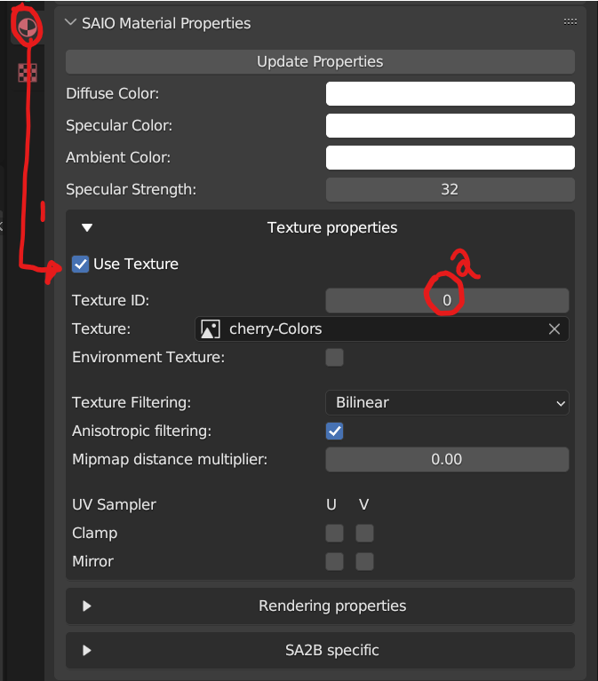
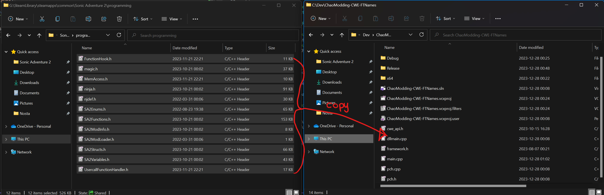
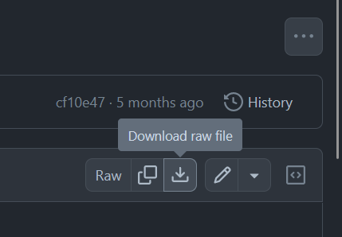

# Hat Mods

## Pre-requisites:

* Have completed the [Making a DLL Project](MakingProject.md) section
* The latest version of Blender
    * Blender SAIO plugin
* Basic 3D Theory
* Basic C++ Programming skills
* SA Tools (Make sure you've created an SA Tools Project!)
* Chao World Extended (Versions > 9.5)
* Patience

Tools can be downloaded [here](tools.md)

## What is a "Hat"?

Hats are the classic style of accessory given to you by Sonic Adventure 2, where a Chao is able to pick up the hat and place it on their head, replacing it with the model. Do note the skeleton dog has to have at least been used once in order for a Chao to wear a hat. You can find skeleton dogs in Pumpkin Hill Zone which will help you along your way.

There are a limit of 255 hat slots in total, some of which are already taken by Sonic Adventure 2 by default.

!!! note "Minor Change since previous documentation:"

    In the previous documentation, Head accessories were considered as "hats" - Now that the API allows you to add vanilla hats, they are categorized differently, but the method is the same. If you want to create a Head accessory, click [here](AccessoryModding.md)!

## Modelling

### Before we start:

* Delete all default scene objects! These objects will crash your game if you do not delete them.
* Make sure SAIO is up to date! As of writing, SAIO 2.1.2 is the most recent. Keeping SAIO and Blender up-to-date will help anyone helping you eliminate issues.
* Make sure SAIO is enabled in the Addons menu! If not, go to Edit -> Preferences and go to the Addons menu to install/enable "Import-Export: Sonic Adventure I/O"
* If SAIO errors out on any operation, and it complains about .NET runtime, install the [Microsoft .NET Runtimes](https://dotnet.microsoft.com/en-us/download) as instructed by the [SAIO Documentation](https://x-hax.github.io/SonicAdventureBlenderIO/).


### Importing the model

In blender, bring up the properties panel by pressing ++n++, and navigate to the SAIO Tools tab, then click import model.


Navigate to your project folder that you created with SA Tools (Should be in Sonic Adventure 2's folder under "Projects"), navigate to `Chao/Models/AL_RootObject` and select a Chao. Make sure that it is a sa2mdl file. For this example we will be using al_ncn.sa2mdl 

How to find what type your file is: Use [the Reference page on what Chao filename you want.](RefChaoFiles.md)
### Modelling the hat

For hats, model or import your model over the head of the Chao, minding the position of the head. Once your model is placed in the correct place, Add an Object Constraint, with the constraint being "Child of", and use the eyedropper on the head of your Chao.  Once done, click the "Clear Inverse" button to clear the Inverse Correction of the Child Constraint, putting it in place where it's supposed to be. On export, it will auto triangulate.


Note: There is a **vertex limit of 32768**.

Once done, delete the hierarchy of the Imported Chao.


Below, is the example of the sample model I made for the hat mod.


## Texturing in Blender

Texture your model as you would when making a model, taking into mind the size of your UVs. A smaller UV size would be preferred to make loading quicker.

Once done, open your texture menu in Blender, and open the SAIO Material Properties.



Check the "Use Texture" checkbox to use textures for your model (1), and make sure to set your texture ID (2). this corresponds to the local ID that will be loaded when you look it up in Texture Editor. Do this for any other materials you're applying to the model.

Make to save and export your file as SA2MDL so that the texture information can be held by the file. You are now done with Blender and can safely close the file. Save a backup .blend file of your model just in case of complications or difficulties for someone to help out.

## Assigning the texture in Texture Editor

Once you're done with setting the above settings on Blender, save your model and your texture and go to Texture Editor.


Add or remove the textures you want in the mod by clicking the "Add..." or "Remove" buttons at the bottom of the window (1). The index (2) corresponds to the Texture ID that you set in Blender. Create a unique Global ID (3) for each of your textures, so that your mod doesn't conflict with other mods.

Save the texture file as `.PAK`, and keep it aside for later.

## Code:

If you have not created a Visual Studio project yet, follow the instructions on "[Setting up your development environment](DevSetup.md)".

### Adding the dependencies:

Go into your Sonic Adventure 2 folder, and find the "programming" directory. Copy all of the files into your Visual Studio Project folder.



For advanced users, the most up-to-date dependencies can be found in [Tools](tools.md) inside the "SA2Modloader includes" github page.

Clone or download `ModelInfo.h` and `ModelInfo.cpp` from [LibModUtils](https://github.com/X-Hax/sa2-mod-loader/tree/master/libmodutils).

To download the file in Github, click on each file you want, and click the download button on the right hand side of the header of the code preview.



Place these two files into your Visual Studio Project folder, where the other dependencies have been placed.

You will need to change the first include in `ModelInfo.cpp` in order to fix a problem -- change `#include "stdafx.h"` to `#include "pch.h"`.

If you don't replace the include, this error will occur!


Afterwards, Add the files into your project by right clicking "Header Files" in your project explorer and going to Add -> Existing Item... to add `ModelInfo.h` and `ModelInfo.cpp`


### Copying the boilerplate code:

Add a new source file and call it `main.cpp`

Copy the [Chao World Extended API Code Template](CWEAPICodeTemplate.md) and paste it into the fresh `main.cpp` file that you've added to the Visual Studio project.

### Creating a custom Texture file:

Inside the `extern "C"` function, the following two lines:

```cpp
NJS_TEXNAME ExampleTex[10];
NJS_TEXLIST example_texlist = { arrayptrandlength(ExampleTex) };
```

Let's break these two lines down:

`NJS_TEXNAME` - The name of your texture loader. change `ExampleTex` with a unique name, and replace the number inside of the square brackets (the array assignment) to the amount of textures your mod will have.

`NJS_TEXLIST` - The texture list - Assign this to your `NJS_TEXNAME` so that it knows how to read it. Give it a unique name, since you reference this in any API calls that need your texture.

Inside the CWELoad function, Load the texture file with the following code:

```cpp
cwe_api->RegisterChaoTexlistLoad("ExampleTex", &example_texlist);
```

`RegisterChaoTexlistLoad()` takes two arguments - The name of your texture file (without the .PAK at the end of it) and a reference call to the `NJS_TEXLIST` that you created.

### Adding Black Market Attributes

Add the following code below the texture list variables:
```cpp
BlackMarketItemAttributes BMExampleHat = { 1000, 500, 0, -1, -1, 0 };
```

Let's break it down:

`BlackMarketItemAttributes` - This is a struct inside of the CWE API which contains the following, in the following order:
 
 * PurchasePrice - The selling price of the item sold.
 
 * SalePrice - the buying price if you're selling the item back to the Black Market.
 
 * RequiredEmblems - The amount of emblems required in the game (0 to 180 is possible in game, anything higher and they will not be able to be purchased through the Black Market.)
 
 * -1 - Name - Keep this as is, we define it in the AddHat function.
 
 * -1 - Description - Keep this as is, we define it in the AddHat function.
 
 * 0 - Unknown - Keep this as is.

### Adding Custom Models:

Create a `ModelInfo` pointer variable for each of the models you are about to add inside the `extern "C"` function. For example:

```cpp
ModelInfo* MDLExampleHat;
```

This is empty at the moment, so let's define it. In the `Init` function. underneath the `pathStr` variable, add the following for each model:

```cpp
MDLExampleHat = new ModelInfo(pathStr + "ExampleHat.sa2mdl");
```

Replace `MDLExampleHat` with whatever your `ModelInfo` pointer variable was called, and change the filename to the appropriate model.

### Adding the hat:

Now it's time to add the hat! In the CWELoad function, call the `AddChaoHat` function from the CWE API. For example:
```cpp
cwe_api->AddChaoHat(MDLExampleHat->getmodel(), &example_texlist, &BMExampleHat, "Example Hat", "Example Hat Description");
```

Let's break it down:

`cwe_api->AddChaoHat()` - This is the function call you will need to make.

`MDLExampleHat->getmodel()` - This has two parts: the `ModelInfo` pointer variable you created, and `getmodel()`, which assigns the model to the Chao Hat.

`&example_texlist` - This is a reference call to the texture list you created above.

`&BMExampleHat` - This is the Black Market Attributes (the information needed for the Black Market to sell the item). This can be `NULL` referenced if you don't want to sell the hat, and obtain it through other means.

`"Example Hat"` - This is the name of the hat.

`"Example Hat Description"` - This is the description of the hat.

Do this for as many hats that you wish to create! reminder that there is a limit of 255 hats, some taken up by the vanilla game (this includes eggs, too).

### Building the Project:

Your solution configuration should be "Release" and your solution platform should be "x86" so that your mod is small, and does not have the additional code inside your mod. Your configurations should look like the following image below:


Build the project by pressing ++f6++ or going to Build -> Build Solution. If you have a "Build Succeeded" in your tooltip at the bottom left of your Visual Studio window, proceed. If you have a "Build Failed" message, have a look at the [Sample mod](examples.md) to see where you went wrong, and try again. 

If you still can't get your build to work, try using the example mod as a template.

## Creating the mod:

If you haven't followed [Making a Project](MakingProject.md), set up your mod folder. Copy the DLL file from inside your release folder into your mod folder and edit your "mod.ini" file to contain your DLLFile. For example:

```ini
DLLFile=ExampleMod.dll
```

Place your .SA2MDL models inside the mod folder.

Add a folder in your mod directory called "gd_PC", and inside that folder, add another directory called "PRS". Inside the "PRS" folder, add your `.PAK` texture files.

Save your "mod.ini" file and test your mod!