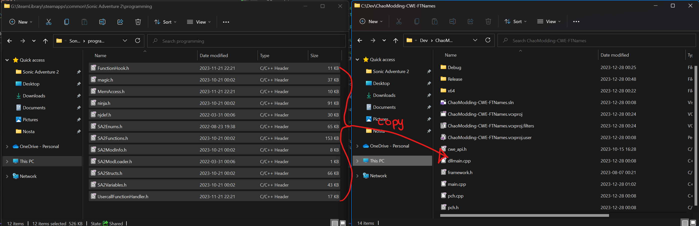
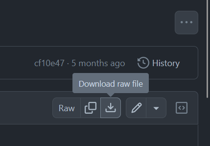

# Custom Lenses

## Pre-requisites:

* Have completed the [Making a DLL Project](MakingProject.md) section
* The latest version of Blender
    * Blender SAIO plugin
* Basic 3D Theory
* Basic C++ Programming skills
* SA Tools (Make sure you've created an SA Tools Project!)
* Chao World Extended (Versions > 9.5)
* Patience

Tools can be downloaded [here](tools.md)

## What is a "Lens"

Lenses are a Chao World Extended addition, allowing you to change the texture of your Chao's eyes. They were introduced in Version 8 alongside the Custom Animal system, and are now available for customization and modification (>version 9.5)

## Modelling

!!! tip "Advice"
    Chao World Extended has a stock lens available. If you want to skip modelling a lens case, click [here]() to download the stock lens!

### Before we start:

* Delete all default scene objects! These objects will crash your game if you do not delete them.
* Make sure SAIO is up to date! As of writing, SAIO 2.1.2 is the most recent. Keeping SAIO and Blender up-to-date will help anyone helping you eliminate issues.
* Make sure SAIO is enabled in the Addons menu! If not, go to Edit -> Preferences and go to the Addons menu to install/enable "Import-Export: Sonic Adventure I/O"
* If SAIO errors out on any operation, and it complains about .NET runtime, install the [Microsoft .NET Runtimes](https://dotnet.microsoft.com/en-us/download) as instructed by the [SAIO Documentation](https://x-hax.github.io/SonicAdventureBlenderIO/).

### Things you will need:

* A texture for the eyes (make sure they fit within the eye spec of a Chao model, test as appropriate)
* A model for your lens case.

## texturing

The following textures are needed in the following order:

* Default lens
* Small eyes
* Dark Chao eyes
* Hero Chao eyes
* Neutral Chaos Chao eyes
* Hero Chaos Chao eyes
* Dark Chaos Chao eyes

You're allowed to add any textures needed for the lens casing thereafter.

!!! note
    
    Hero and Dark swap around for Chaos Chao eyes. Bear this in mind.

## Code:

If you have not created a Visual Studio project yet, follow the instructions on "[Setting up your development environment](DevSetup.md)".

### Adding the dependencies:

Go into your Sonic Adventure 2 folder, and find the "programming" directory. Copy all of the files into your Visual Studio Project folder.



For advanced users, the most up-to-date dependencies can be found in [Tools](tools.md) inside the "SA2Modloader includes" github page.

Clone or download `ModelInfo.h` and `ModelInfo.cpp` from [LibModUtils](https://github.com/X-Hax/sa2-mod-loader/tree/master/libmodutils).

To download the file in Github, click on each file you want, and click the download button on the right hand side of the header of the code preview.



Place these two files into your Visual Studio Project folder, where the other dependencies have been placed.

You will need to change the first include in `ModelInfo.cpp` in order to fix a problem -- change `#include "stdafx.h"` to `#include "pch.h"`.

If you don't replace the include, this error will occur!


Afterwards, Add the files into your project by right clicking "Header Files" in your project explorer and going to Add -> Existing Item... to add `ModelInfo.h` and `ModelInfo.cpp`


### Copying the boilerplate code:

Add a new source file and call it `main.cpp`

Copy the [Chao World Extended API Code Template](CWEAPICodeTemplate.md) and paste it into the fresh `main.cpp` file that you've added to the Visual Studio project.

### Creating a custom Texture file:

Inside the `extern "C"` function, the following two lines:

```cpp
NJS_TEXNAME ExampleTex[10];
NJS_TEXLIST example_texlist = { arrayptrandlength(ExampleTex) };
```

Let's break these two lines down:

`NJS_TEXNAME` - The name of your texture loader. change `ExampleTex` with a unique name, and replace the number inside of the square brackets (the array assignment) to the amount of textures your mod will have.

`NJS_TEXLIST` - The texture list - Assign this to your `NJS_TEXNAME` so that it knows how to read it. Give it a unique name, since you reference this in any API calls that need your texture.

Inside the CWELoad function, Load the texture file with the following code:

```cpp
cwe_api->RegisterChaoTexlistLoad("ExampleTex", &example_texlist);
```

`RegisterChaoTexlistLoad()` takes two arguments - The name of your texture file (without the .PAK at the end of it) and a reference call to the `NJS_TEXLIST` that you created.

### Adding Black Market Attributes

Add the following code below the texture list variables:
```cpp
BlackMarketItemAttributes BMExampleHat = { 1000, 500, 0, -1, -1, 0 };
```

Let's break it down:

`BlackMarketItemAttributes` - This is a struct inside of the CWE API which contains the following, in the following order:
 
 * PurchasePrice - The selling price of the item sold.
 
 * SalePrice - the buying price if you're selling the item back to the Black Market.
 
 * RequiredEmblems - The amount of emblems required in the game (0 to 180 is possible in game, anything higher and they will not be able to be purchased through the Black Market.)
 
 * -1 - Name - Keep this as is, we define it in the AddHat function.
 
 * -1 - Description - Keep this as is, we define it in the AddHat function.
 
 * 0 - Unknown - Keep this as is.

### Adding Custom Models:

Create a `ModelInfo` pointer variable for each of the models you are about to add inside the `extern "C"` function. For example:

```cpp
ModelInfo* MDLExampleHat;
```

This is empty at the moment, so let's define it. In the `Init` function. underneath the `pathStr` variable, add the following for each model:

```cpp
MDLExampleHat = new ModelInfo(pathStr + "ExampleHat.sa2mdl");
```

Replace `MDLExampleHat` with whatever your `ModelInfo` pointer variable was called, and change the filename to the appropriate model.

### Adding the Lens

There's a few things we will need to add before a lens is able to be registered. In the `Extern "C"` function, add the following line just below the `RegisterDataFunc` function pointer:

```cpp
	//Lens function - Needed for CWE to recognize the lens.
	__declspec(dllexport) void(__cdecl* ALS_LensSpecial)(ObjectMaster*, ObjectMaster*);
```

In the `Init` function, add the following line just below the `PathStr` varaible:

```cpp
	//Lens function - This talks to CWE to get the lens to work when registering it as a special object.
	ALS_LensSpecial = (decltype(ALS_LensSpecial))GetProcAddress(GetModuleHandle(L"CWE"), "ALS_LensSpecial");
```

Now add the `RegisterChaoSpecial()` function, to register it to the Black Market:

```cpp
    //Register your lens to the black market:
    cwe_api->RegisterChaoSpecial(MDLExampleLensBox->getmodel(), &Example_texlist, &BMExampleLens, ALS_LensSpecial, NULL, "Lens Name", "Lens Description", false);
```

And associate the lens with your texture:

```cpp
//Associate the lens as a custom eye color:
cwe_api->RegisterEyeColor("ExampleTextureName", &Example_texlist, ExampleLensID);
```

### Building the Project:

Your solution configuration should be "Release" and your solution platform should be "x86" so that your mod is small, and does not have the additional code inside your mod. Your configurations should look like the following image below:


Build the project by pressing ++f6++ or going to Build -> Build Solution. If you have a "Build Succeeded" in your tooltip at the bottom left of your Visual Studio window, proceed. If you have a "Build Failed" message, have a look at the [Sample mod](examples.md) to see where you went wrong, and try again. 

If you still can't get your build to work, try using the example mod as a template.

## Creating the mod:

If you haven't followed [Making a Project](MakingProject.md), set up your mod folder. Copy the DLL file from inside your release folder into your mod folder and edit your "mod.ini" file to contain your DLLFile. For example:

```ini
DLLFile=ExampleMod.dll
```

Place your .SA2MDL models inside the mod folder.

Add a folder in your mod directory called "gd_PC", and inside that folder, add another directory called "PRS". Inside the "PRS" folder, add your `.PAK` texture files.

Save your "mod.ini" file and test your mod!