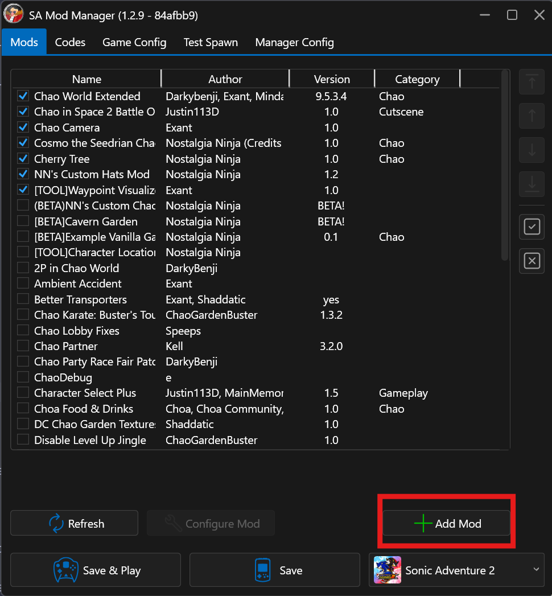
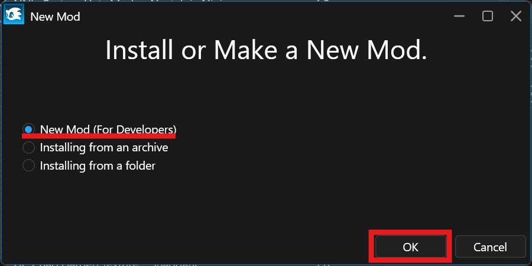
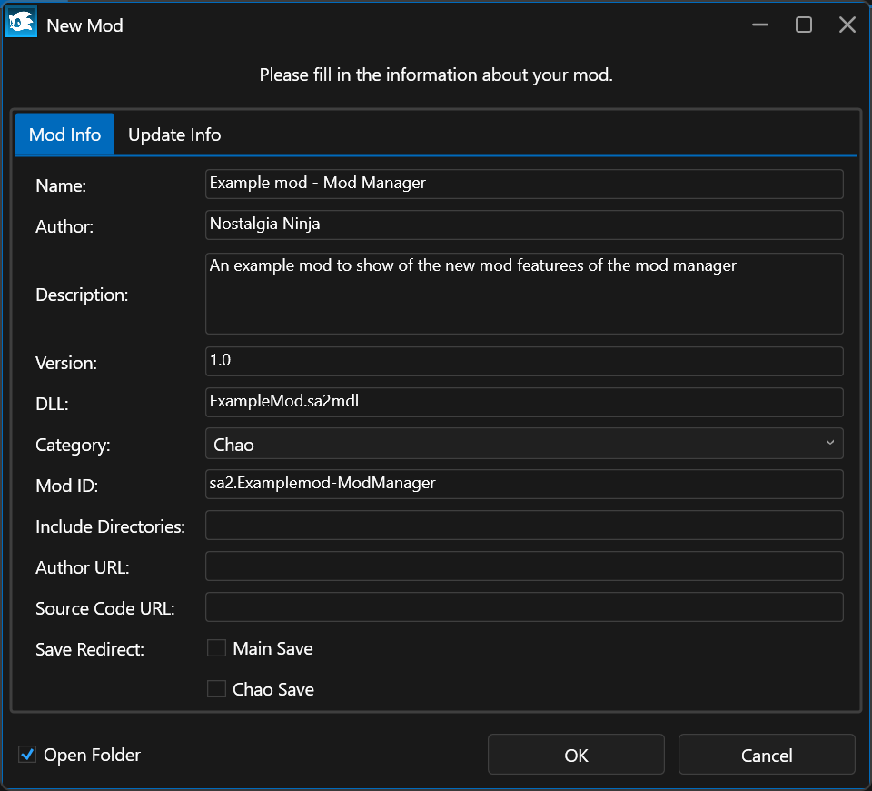
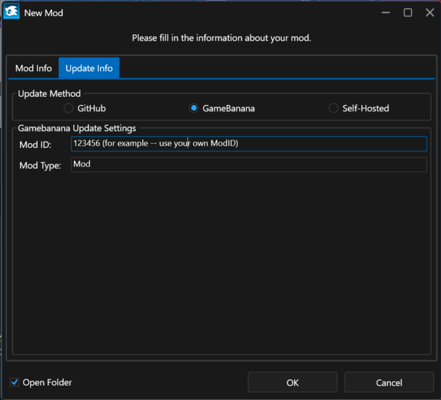

# Making a project

## Requirements
* Sonic Adventure 2
* Latest SA Tools

See [Tools](resources.md) to download these required tools if you haven't already.

## Old Method: Manually making a mod folder

### Setting up a mod folder:

1. Create a folder in the /Mods folder in Sonic Adventure 2
2. Create a new "mod.ini" file
3. Add the following text, entering the parameters required for the mod:

    ```
    Name=
    Author=
    Version=
    Description=
    GitHubRepo=
    GitHubAsset=
    UpdateUrl=
    DLLFile=
    Category=
    ```

## New Method: SAModManager

1. Open SA Mod Manager and click on "New Mod"



2. Click on "New Mod (For developers)" and click "OK"



3. Fill out the information on the "Mod Info" tab



4. Move over to the "Update Info" tab if you want to autoupdate your mod (optional) and fill out the information there, too! For Github, you just need your author and repository info, and the release asset to update as necessary. For Gamebanana you just need the mod ID (found in your mod page)



5. Your mod folder will be automatically made for you. The mod folder will open once it has been created, and you're ready for the next step.

## Creating a project

You should have your own SA2MDL files for Chao modification, as you will be constantly using them as references. This uses SA Tools to create a project structure that will rip the necessary models.

1. Open SAToolsHub.exe
2. Go to Projects -> New Project.
    * Select Sonic Adventure 2 for the game you are modding.
    * Select Template - PC - SA2
    * Click Create Project (The game should ask you where your Sonic Adventure 2 Folder is the first time around, that is where the game loads.) 
3. Let the game split all the project files as necessary. You should have a complete project with everything exported.