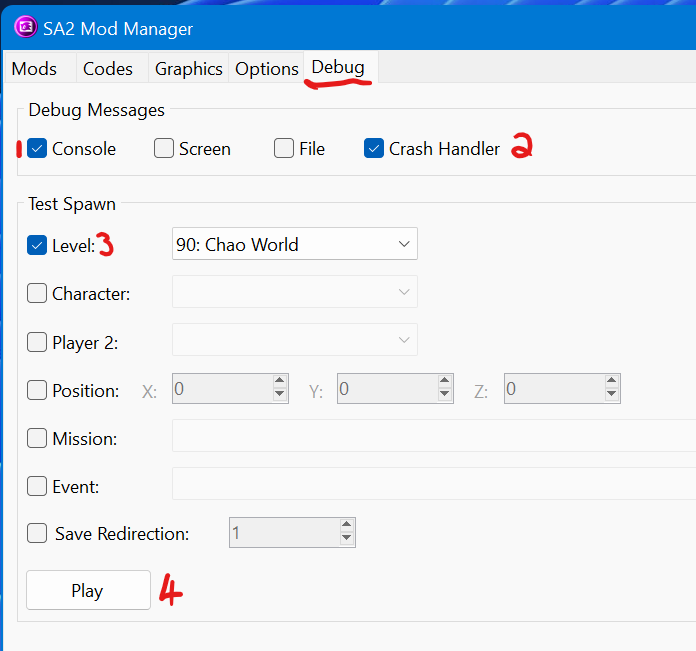
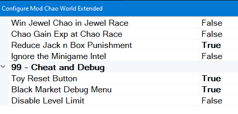
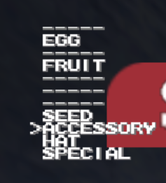

# Tips for beginners: Testing Mods

More often than not, you'll finish a mod and want to test it right away to see if everything is in order.  This page gives you some insight on how to test your mod.

## SA2 ModLoader Settings

The following settings are what I (Nostalgia Ninja) personally use:

1) Console Debug - This allows you to see any errors and determine *where* your mod crashes if it does. Usually you'd find issues when initializing Chao World (entering the stage from stage select or after a stage if you've collected a Chao Key)

2) Crash Handler - This should be turned on by default. If your game crashes, it will dump the contents of your crash information into the CrashDump, along with your ModLoader items in their order. This helps more experienced people to help you if in case you get stuck with your mod and you ask for help.

3) Test Spawn Level - This allows you to open the game and load directly into a stage (example: Chao World) - This is useful if you know your mod works and just want to test certain parameters at a time.

4) Play - runs the game starting you directly into the Test Spawn.

## Tips for debugging issues in your game

In the code, `PrintDebug()` allows you to print a string or value by adding in parameters to check. Don't forget to [cast](https://en.cppreference.com/w/cpp/language/explicit_cast) your types into C-Strings as the function accepts a `char *` argument.

## Chao World Extended debug configurations:

To check if your Black Market items work, use the Black Market Debug Menu. While in the Black Market, press ++x++ and ++y++ on the gamepad (or yellow and blue inputs on the keyboard) to access. Use the category selector to pick the category of your Black Market item, and then find your Black Market item.

