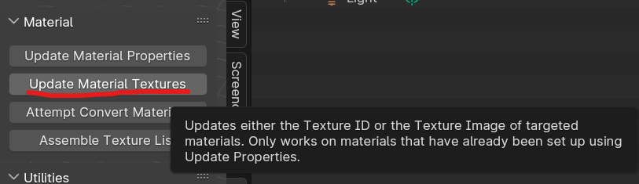
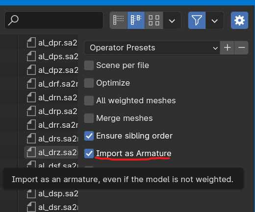

# Tips for beginners: Sonic Adventure IO

So you're getting started with Sonic Adventure IO? Here are a few tips and tricks to get going as quickly as possible!

Remember to check out the [Sonic Adventure IO Reference Manual](https://x-hax.github.io/SonicAdventureBlenderIO/)!

## What is Blender Sonic Adventure IO?

Blender Sonic Adventure IO (SAIO for short) is a Blender plugin made by Justin113D and the X-Hax Community used for general purpose model modding for Sonic Adventure DX and Sonic Adventure 2. It features a robust set of features, From basic model editing, Level editing features, and Texture editing features, to robust features like Path editing, internal texture editing (this means you don't even have to touch TextureEditor), animation, scene management and rendering.

## What do the current modding guides focus on?

Currently, the modding guide focuses on model editing, texture editing and some parts of internal texture editing.

## Tip 1: Texture files in SAIO

### Creating a new texture file:

Texture files in SAIO provide easy asset management while also creating models. Once you import your models, go to SAIO Scene-> Textures. Press the "+ New" button to get a setup of textures for your model.

To add a texture, press the + button. Add your textures as you want to lay them out in your Sonic Adventure 2 texture file.

Once you have added a texture, click the "Image" text area. A dropdown for scene-loaded textures will appear. Select your image.

Name your slot what you would like to call your texture, make a unique Global Index for the texture and you should be done! Export your Texture File.

### Import/Export:

If you press the dark gray down arrow button, you'll see options to Import or Export the texture file. Import a model by clicking "Import texture Archive". Export a model by using "Export as texture Archive".

### Updating Material Textures:

There's an easy way to get your textures from Sonic Adventure 2 into Blender applied to your model:

* Import your model (see above on how)

* got to SAIO Tools -> Material and click "Update Material Textures". Click "OK" and then go into Viewport shading to see if the model corresponds to what you expect in-game.

SAIO is smart enough to pick up your textures based off Texture IDs, but if it doesn't, you'll have to import it manually.

## Tip 2: Import as Armature

There are times when you need an armature instead of a node-based model (Accessories for example). You can do this quickly without needing to import the node-based model and creating an "Armature from Objects"

Here's how:

1) go to SAIO Tools -> Import -> Import Model.
2) in the right pane of the model import dialog box, tick "Import as Armature"

