# Troubleshooting

Below, are all the common issues that you'll have with your mods:

## General issues:

### Texture File Not Found

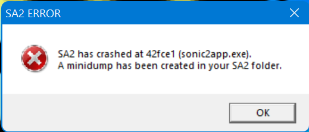
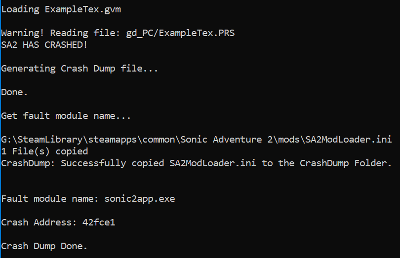

Oh No! Your game has crashed! Something's wrong with your mod!

Not to worry! We have things that we can check!

A common crash would be that the texture file fails to load, and the game crashes. The following would usually resolve the issue:

* Check if your filename matches what you've written in code.

* Check if your TexList has enough space to load the texture file.

* DO NOT rename your texture file! Doing so causes the game to incorrectly find the file, and crashes the game. Instead, use the Save As option in TextureEditor, and make a new texture file with the name as given.

### Model File Not Found

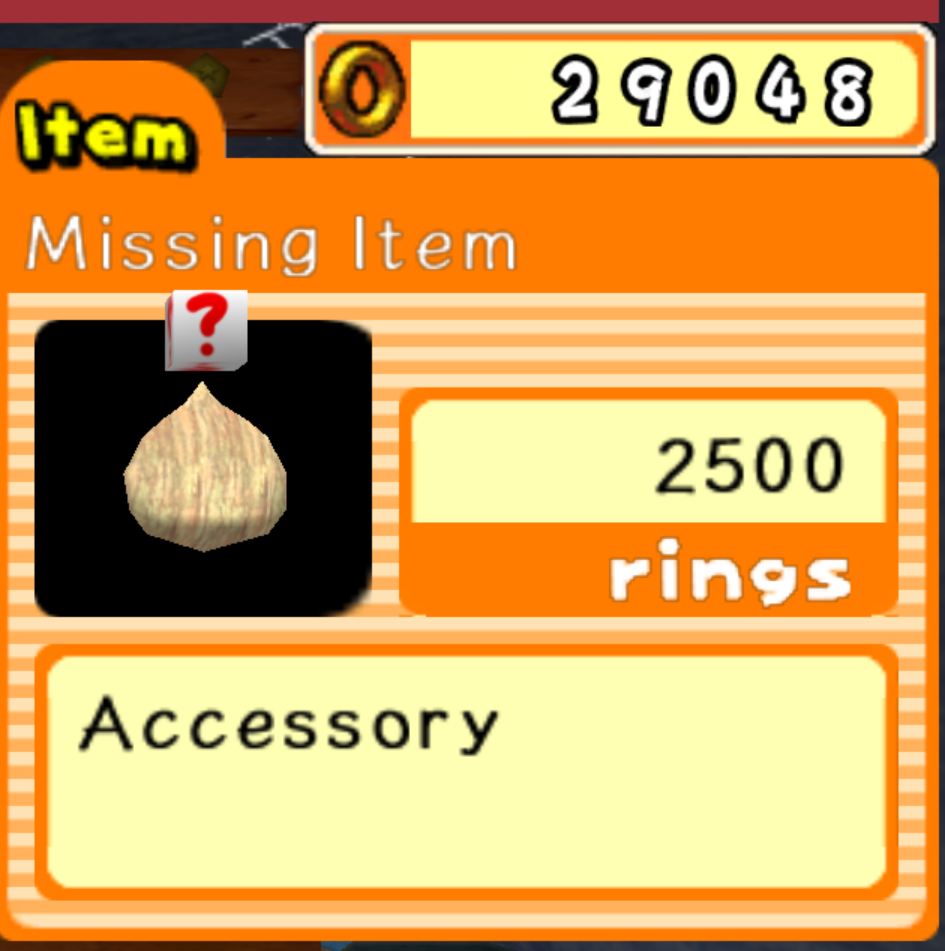

Chao World Extended checks for the model, and if it doesn't load, will give you the above image. This can be a combination of things:

* The model can't be found in the location you specified. Place your model in the right directory and try again.

* Make sure your `pathStr` is pointing to the right place.  By default, the `pathStr` variable is as follows:

```cpp
std::string pathStr = std::string(path) + "\\";
```

This places it in the same place as where you put your `mod.ini` file.

## Animation:

### The model crashes when an animation is started

Chao World Extended runs fine, but when a Chao starts to do a replaced animation, your game crashes!

In order to fix this, you'll need to go into the dope sheet and delete all the scaling keyframes, as Chao don't support any scale keyframing.

Select all your bones, then go to the animation timeline, change the editor type to Dope Sheet, Action Editor and then hover over your timeline. Press ++ctrl+spc++ to enter "Toggle Maximize Area". This will allow us to see all our keyframes without distractions, and is an optional, but helpful shortcut.

select each scale keyframe in your timeline (++shift++ select if you want to select multiple) and then press ++x++ or ++del++ to delete the keyframes.

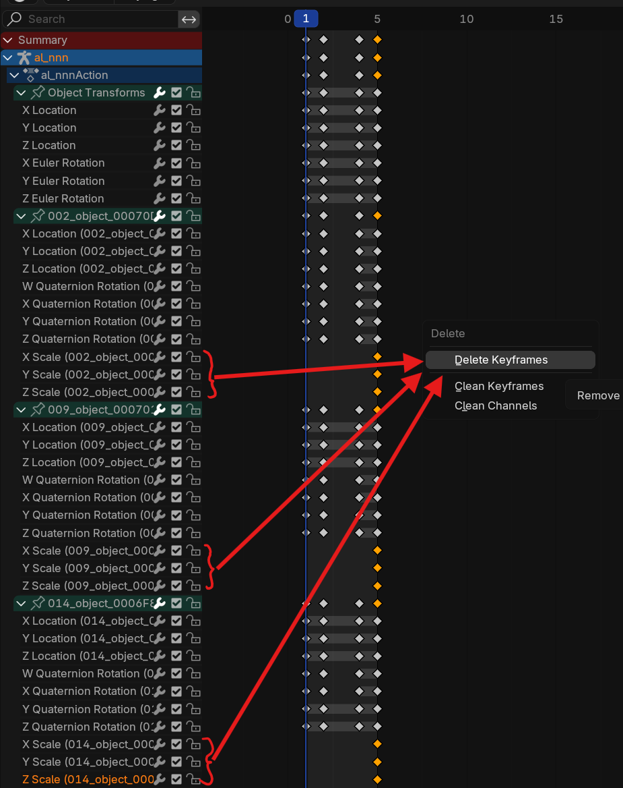

To exit the "Toggle Maximize Area" mode, press ++ctrl+spc++ again.

Save your animation and try again.

## Character Chao:

### texture index is out of bounds

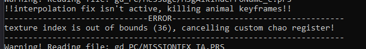

Chao World Extended checks your Character Chao model and it determines that your Texture Index is out of bounds. The following steps are required in order to fix it:

* Load your texture file into SAIO (If you don't know how to do so, click [here](https://x-hax.github.io/SonicAdventureBlenderIO/guides/texturing/#importing-exporting)!)

* Once your texture file is loaded, scroll down and look for the last texture in the list. Note down the number, and add 1 to that.

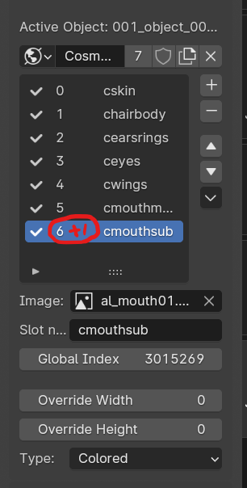

* Now that you've got the amount of textures, update your variable to the noted number.

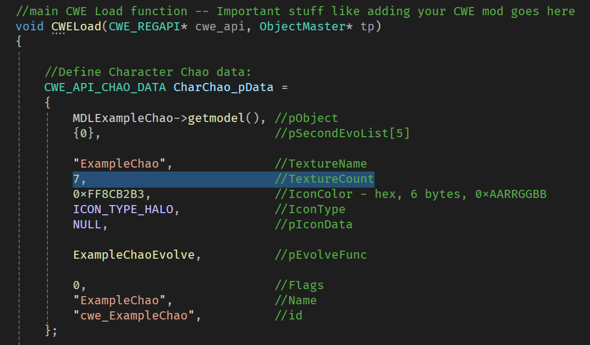

also, check the SAIO Material Properties on every object (including eyes, mouth and wings) and make sure that it is added to the texture file and inside the texture count.

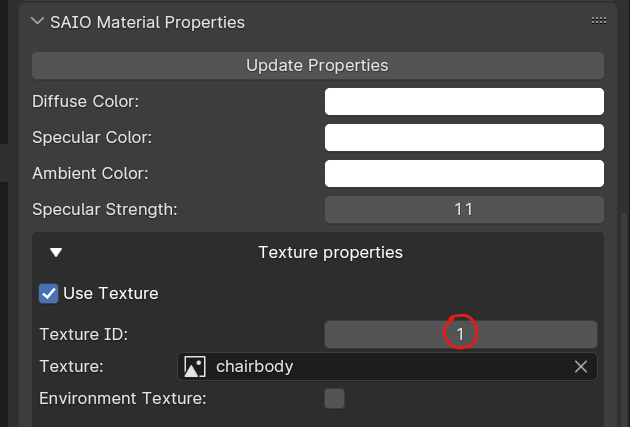

### Number of Nodes is not 40

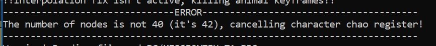

Chao World Extended checks your Character Chao model and it determines your model is not 40 nodes. The following steps are required in order to fix it:

In Blender:

* Turn on statistics in your Overlay Menu:

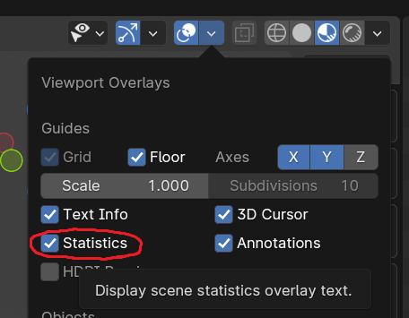

* Look at the total number of Objects. They should be 40, no more and no less!

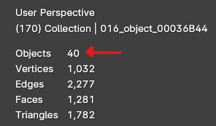

* If you don't have 40 objects, you may not have joined your objects together, or you may have mistakenly joined your objects together. To join objects, press ++ctrl+j++ in Object Mode. to separate objects, press ++p++ in Edit Mode.

Note: If you accidentally joined objects from the Chao Model together, you will have to restart from importing the Chao model, as you have destroyed node data that is important for the Chao model to function.

### Wrong Chunk Type

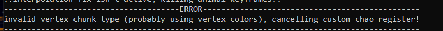

Chao World Extended checks your Character Chao and determines that your model has an invalid vertex chunk type. The following steps are required in order to fix it:

In Blender:

* Go to the Data menu, and open the Color Attributes dropdown. If you see anything in here, remove it by clicking the - button.

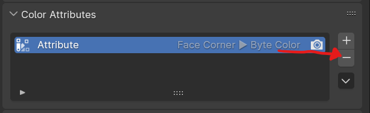

### Emote ball missing

This happens when the alpha channel for the Emote Ball has not been set. A reminder that it should be AARRGGBB (Use a web color helper, and just put FF at the front of the color you want for full alpha transparency.)

## Fruit:

### Fruit mods - Size or rotation is weird in Black Market

To Fix this, Import your completed model and apply your transformations.

For Size:

* Apply the Scale transformations by selecting the model in Object mode and pressing ++ctrl+a++ and applying by scale.

For rotation:

* Apply all transformations by pressing ++ctrl+a++ and applying by All.

Note that applying all transformations will move the object origin to 0, 0, 0 in Blender World Space, so make sure your model is centered on the world origin before applying transformations.  If your model isn't centered, right click on your model and go to Set Origin -> Origin to Geometry.

### Model is invisible in Black Market

This is a known bug in Sonic Adventure 2 where if a model has multiple meshes, the game will not render anything in the Black Market. To fix this:

* Import your completed model into Blender (Remember to remove all other objects beforehand.)
* select all objects
* select your primary object (to be neat about the join you're about to make)
* press ++ctrl+j++ to join all the objects together.

### Model is bigger/smaller than I want it to be in the Black Market

In Blender, there is a way to adjust the fruit so that it appears bigger or smaller in the Black Market, regardless of its actual size.

To make your fruit ***smaller*** in the Black Market, go to **Edit Mode** on Blender and shrink your fruit.  Then, go to **Object Mode** and expand your fruit (until it's back to it's original size again). 
Now, in the Black Market, your fruit will look smaller.

To make your fruit look ***BIGGER***, do the same thing in reverse: go to **Edit Mode** on Blender and expand your fruit.  Then, go to **Object Mode** and shrink your fruit to its original size.

## Animal:

### Animal mod is spawning seals

You are testing your mod and for some reason, seals are spawning from your fruit. 

Check your code.  Make sure that the minimum and maximum chance counts up from `0` to `100` for your `RegisterChaoMinimalFruit`.  For example:

```
cwe_api->RegisterChaoMinimalFruit(ExampleFruitID, mini_ExampleAnimalID, 0, 33;
cwe_api->RegisterChaoMinimalFruit(ExampleFruitID, mini_ExampleAnimalID, 34, 66;
cwe_api->RegisterChaoMinimalFruit(ExampleFruitID, mini_ExampleAnimalID, 67, 100;
```

If there is a point that it doesn't fully goes from 0 to 100, *that* is where a seal will spawn.

### Animal textures are wrong or 1 solid color

In Blender, make sure to check that the texture ID for your Animal model is set to the same index number in your animal's texture PAK. 

The same goes to the animal parts for the chao.

